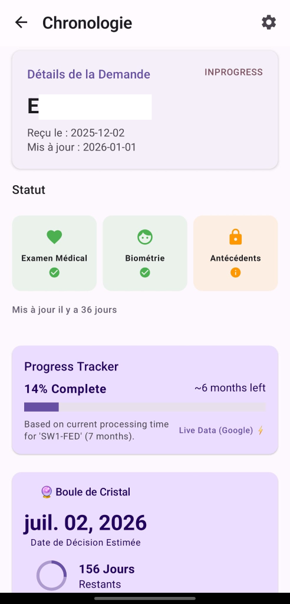
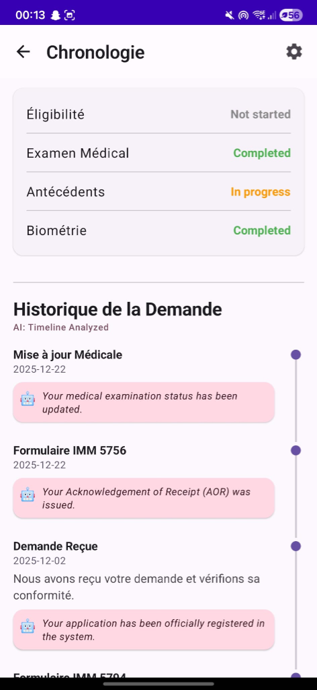

# MyCanada Tracker 🇨🇦

   

A free, privacy-focused Android app to track your Canadian Immigration status. Built by a geek who was tired of refreshing the official website. 🤓🇨🇦

  

## ⚠️ IMPORTANT DISCLAIMER

**This is a personal hobby project.**

*   **Unofficial**: This app is **NOT** affiliated with IRCC. It's just a tool I built for myself using AI.
*   **Use at your own risk**: It works great for me, but since I'm just figuring this out as I go, I can't guarantee it will work forever.
*   **Privacy**: The app runs locally on your phone. I don't see or store any of your data.
*   **Check Official Sources**: Always verify your status on the [Official IRCC Website](https://www.canada.ca/en/immigration-refugees-citizenship.html).

> **Note**: I specifically tested this for my **Permanent Residence (PR)** application. It should work for others, but your mileage may vary.

---

## ✨ Features

- **📊 Visual Dashboard**: See your application status at a glance with beautiful progress bars and status cards.
- **📚 Smart Dictionary**: Instant, offline explanation of immigration codes (e.g. "IMM 5756") using a built-in static database.
- **📱 Home Screen Widget**: Keep track of your status without even opening the app.
- **🔮 "Crystal Ball" Forecast**: Estimates your completion date based on official IRCC data (stored locally).
- **📶 Offline First**: Works entirely without internet (once data is fetched). 100% Privacy.
- **🇫🇷 Bilingual**: Full support for English and French.
- **📰 IRCC News**: Live news feed directly from the official Government of Canada RSS source.
- **🔔 Smart Notifications**: The app monitors your status for you. Stop refreshing the website 100 times a day—we'll ping you if something changes.
- **⏱️ Auto-Check**: The app automatically checks for updates in the background.

## 📸 Screenshots

  
  &nbsp;&nbsp;&nbsp;&nbsp;
  

## 🔒 Security & Privacy

- **Your Data Stays With You**: This app runs locally on your device. It communicates directly with IRCC servers.
- **No AI / No Cloud**: We removed all Artificial Intelligence components. No data is sent to Google, Gemini, or any third-party AI.
- **Official Sources**: 
    - Status: `https://ircc-tracker-suivi.apps.cic.gc.ca/`
    - News: `https://api.io.canada.ca/`
- **Open Source**: The code is open for review to ensure transparency.

## 🛠️ Tech Stack

- **Language**: Kotlin
- **UI**: Jetpack Compose (Material 3)
- **Architecture**: MVVM + Clean Architecture
- **Network**: Retrofit + OkHttp + XmlPullParser
- **Data**: Static Dictionary + Local Processing Times
- **Local Storage**: SharedPreferences (Encrypted)
- **Background Work**: WorkManager

## 🚀 Getting Started

1.  Clone the repository.
2.  Open in Android Studio.
3.  Build and Run on your device.
4.  Enter your IRCC credentials (UCI + Application Number).

## 📲 Installation

1.  **Download**: [Click here to download MyCanadaTracker-v3-security.apk](release/MyCanadaTracker-v3-security.apk?raw=true)
2.  **Transfer**: If you downloaded this on your computer, send it to your phone.

## 📝 Changelog

### v3.0 - Security Update (Current) 🛡️
- **Biometric Lock**: Protect your data with FaceID/Fingerprint.
- **Encryption**: All local data is now encrypted with AES-256.
- **Privacy**: Zero AI. Zero Analytics. 100% Local.
- **Fix**: Resolved crash on theme incompatibility.

### v2.0 - De-AI Update
- Removed Google Gemini dependency.
- Added Static Dictionary & RSS Feed.
2.  **Transfer**: If you downloaded this on your computer, send it to your phone.
3.  **Install**:
    - Open the file on your phone.
    - If prompted, allow **"Install from Unknown Sources"**.
    - Click **Install**.
4.  **Enjoy**: Open "MyCanada Tracker" from your app drawer.

## 📄 License

This project is licensed under the MIT License - see the [LICENSE](LICENSE) file for details.

---

*Made with ❤️ for fellow applicants.*
